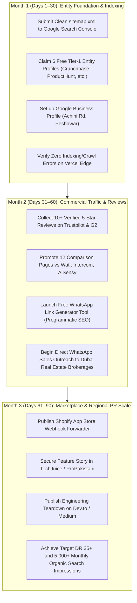

# 🚀 InstantFlow: 30 / 60 / 90-Day Strategic Growth & SEO Roadmap

## Executive Overview
This roadmap is engineered to scale **InstantFlow Technologies** from an unindexed new domain into the authoritative **WhatsApp Business API CRM** across Pakistan, India, the Gulf (UAE, KSA), the UK, and Europe.

Each phase includes **clear deliverables, uncertainty factors, and objective verification checkpoints**.

---

## 🗺️ Roadmap Architecture & Flow

---

## 📅 Month 1 (Days 1–30): Entity Foundation & Indexing Velocity

### Deliverables:
1. **Google Search Console & Bing Webmaster Tools Activation:**
   * Verify domain ownership of `instantflow.online` via DNS TXT record.
   * Submit `https://instantflow.online/sitemap.xml` (contains all 23 clean URLs).
2. **Execute Manual Backlink Action Guide:**
   * Complete the 6 directory listings specified in [MANUAL_BACKLINK_ACTION_GUIDE.md](file:///C:/Users/pc/Documents/SAAS/instantflow-website/MANUAL_BACKLINK_ACTION_GUIDE.md):
     * Crunchbase (Corporate entity)
     * Product Hunt (SaaS Launch)
     * AlternativeTo (Listed as #1 Wati Alternative)
     * SaaSHub
     * Trustpilot
     * GitHub repo website field
3. **Google Business Profile (LocalBusiness):**
   * Register local presence: `Achini Rd, Achini Payan, Peshawar, KP 25000`. Matches schema coordinates `(33.9882, 71.4646)`.

> [!WARNING]
> **Uncertainty Factor:** Google may take 7 to 21 days to crawl and index a brand-new `.online` top-level domain. Submitting manual requests in GSC and acquiring the Tier-1 directory links forces rapid crawler discovery.

### How to Check Results (Verification Checkpoint):
* In Google Search: Run `site:instantflow.online`. Confirm at least 15+ pages show indexed with meta titles matching our clean URLs.
* In Google Search Console: Confirm 0 Coverage Errors and 0 Excluded 308 redirect loops.

---

## 📅 Month 2 (Days 31–60): Competitor Interception & Trust Acceleration

### Deliverables:
1. **Accumulate Verified Client Proof (Trustpilot & G2):**
   * Send direct review invitation links to 10–15 existing paying users or beta testers.
   * Target: Minimum 10 reviews with 4.8+ star rating.
2. **Push Comparison Authority:**
   * Promote [compare/instantflow-vs-wati](https://instantflow.online/compare/instantflow-vs-wati) and [solutions/whatsapp-business-api-pricing-guide](https://instantflow.online/solutions/whatsapp-business-api-pricing-guide) in LinkedIn posts and founder groups.
3. **High-Ticket Dubai & Gulf Outbound Pilot:**
   * Run targeted WhatsApp / LinkedIn outreach to 50 boutique real estate agencies in Dubai Marina, Downtown, and Business Bay using our [Real Estate Playbook](https://instantflow.online/solutions/whatsapp-for-real-estate).

> [!NOTE]
> **Uncertainty Factor:** Competitors (like WATI or AiSensy) periodically adjust their pricing tiers. Review their pricing pages once a month and update our comparison tables accordingly.

### How to Check Results (Verification Checkpoint):
* Search on Google (Incognito): *"Wati alternative without seat pricing"* or *"InstantFlow vs Wati"*. InstantFlow should appear on Page 1 or in AI Overviews.
* Check Google Search Console: Organic impressions exceeding 1,000/month.

---

## 📅 Month 3 (Days 61–90): Marketplace Ecosystem & PR Dominance

### Deliverables:
1. **Shopify App Store Webhook Connector:**
   * Build a lightweight public Shopify App that merchants can install with 1 click to sync abandoned checkouts to InstantFlow.
   * Gives a permanent do-follow backlink from `apps.shopify.com` (DR 94) and direct merchant acquisition.
2. **Press Feature in Pakistan Tech Publications:**
   * Send the PR pitch email from `MANUAL_BACKLINK_ACTION_GUIDE.md` to TechJuice and ProPakistani editors.
3. **Engineering Authority Teardown (Medium / Dev.to):**
   * Publish: *"How We Scaled Meta Cloud API v20.0 Throughput Using Redis Micro-Delays"*. Contextually link back to the [Anti-Ban Guide](https://instantflow.online/solutions/how-to-avoid-whatsapp-ban).

> [!TIP]
> **Uncertainty Factor:** Editorial acceptance rates for guest articles depend on news cycles. If an editor does not respond within 7 days, follow up politely on WhatsApp or Twitter/X.

### How to Check Results (Verification Checkpoint):
* Check Ahrefs / Moz Free Domain Checker: InstantFlow Domain Rating (DR) should rise from 0 to 25–40+.
* Organic inbound signups on `https://user.instantflow.online` originating from Google organic and AI search engines (Perplexity / ChatGPT).

---

## 🎯 Target KPI Scorecard

| Metric | Day 30 Target | Day 60 Target | Day 90 Target |
| :--- | :---: | :---: | :---: |
| **Indexed Pages (site:instantflow.online)** | 20+ | 23+ (All Pages) | 35+ (Including Tools) |
| **Referring Domains (Backlinks)** | 6–10 (Tier 1) | 20–30 | 50+ (Marketplaces & PR) |
| **Monthly Organic Search Impressions** | 500+ | 2,500+ | 7,500+ |
| **Active Trustpilot / G2 Reviews** | 3+ | 10+ | 25+ |
| **Organic Monthly Trial Registrations** | 10–25 | 50–100 | 150–250+ |
